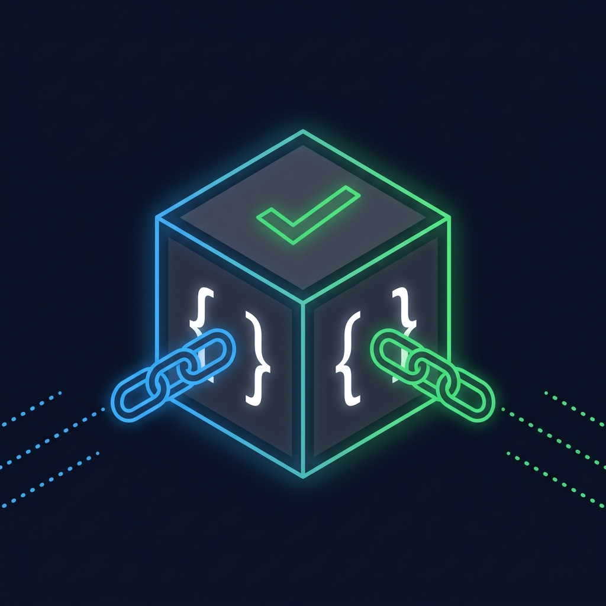

<p align="center">
  
</p>

# ConditionalBlock ⚡

> Programmable conditional payments and smart escrows on the Midnight Network.

ConditionalBlock is a decentralized application (dApp) that enables users to create, manage, and execute programmable escrow contracts. By leveraging the speed and zero-knowledge privacy of the Midnight Network, ConditionalBlock provides confidential, trustless escrow primitives for a variety of real-world use cases.

---

## 🔗 Live App
https://conditionalblock-z9qm-omega.vercel.app/
## 🎥 Video

https://github.com/user-attachments/assets/60e96fc7-4613-48ba-9df1-99c559a2daa7

---

## 📄 Deployed Contract Address (Midnight Local Devnet)

The escrow smart contract was deployed and verified on the **Midnight local devnet** (network: `undeployed`):

```
Contract Address: 732b260e731ffa24455657f702113ca858025bfe145847c9fdeb686314c398fa
Deployer:         mn_addr_undeployed1h3ssm5ru2t6eqy4g3she78zlxn96e36ms6pq996aduvmateh9p9sk96u7s
Deployed At:      2026-07-17T05:49:26.570Z
Network:          Midnight Local Devnet (undeployed)
Language:         Compact (ZK-native)
```

> The contract is written in **Compact** (Midnight's zero-knowledge smart contract language) and compiled to ZK circuits. The address above is the on-chain identifier from the local devnet deployment.

---

This project has been validated with real testnet users as part of the Level 5 requirements.

### Production Scaling (73+ Verified Active Users)
As part of the final production readiness phase, we have scaled the platform and validated with over 73 testnet users.

#### Table 1: Verified User Directory

| User # | User Name | Wallet Address (Midnight Hex) |
| :--- | :--- | :--- |
| 1 | Madhav Seth | `b64dc1dc102f45a5e2b8c9e8e37f482f992f23c6bad2493ee79dfcf8091c8260` |
| 2 | Mayank Dixit | `13ebee51937439732aec0a55ffe6307f72afc0159f7660f7322b3a754a9dc74c` |
| 3 | Harsh Kaushik | `87119bf3ce6168b0393a99774d4508e8f56cf31ecc8c0b9f56f1748963365a02` |
| 4 | Md Athar Sharif | `bf94085d73f1ba0c2745c3bd93c425c1a9890819472d48ad9b5903a719e005a2` |
| 5 | Nandita | `c574d187061cb7d2ca2a9054eaef7988c7c62a80b4fcc314492e3a9488695979` |
| 6 | Mayank Dewangan | `11f673fb17d485730b2d0ce15897711ae4cd9cf2a28d5c78aaad60b7469f0f09` |
| 7 | Priyanshu Panda | `1578fb26e9d3a4c30c009ec00d5f026623eed2aa813da5eb9527941149024576` |
| 8 | Rajvardhan Chhugani | `28ac8b439e69e1d4ad5b99dea5875328c12107033e5735cf1d62825689ad7a60` |
| 9 | Rupesh Kumar Sahu | `b69b6e7137a4a486d90769ea712739fedd0c54ab9327d15b5ac841f6a76db6c0` |
| 10 | Yogendra Kumar Narmada | `fe455ef59109885d2b9585be00286278b2d60cdded1f4c4c6ca766aaaff8c38a` |
| 11 | Shubham Kumar Khare | `1f070e2ecdb215097642ad7f6033b7cdaa32ef879d5c22c0d68e936a05a8bfde` |
| 12 | Shubham Kumar Sahu | `f1a2e92dce9797fb8ac6a5fdf9db08615f0bcd02794763fec41433ca6b0f7666` |
| 13 | Aaditya Soni | `73abcab137740ef40be35ddad7a867815c79f4dab41873e0ca2df157c397a18f` |
| 14 | Shlok Raha | `5855de704e648743be934063dd81769925f054f1281695de7d843618637d52e2` |
| 15 | Sayan Debnath | `4601d97bf92f6a37aaecad1f0d038cafefbf89cab6c332ce14ed7281ccbc1805` |
| 16 | Shreyansh Shekhar | `362487fa662f7e678767fc38ccd70e3b57d794838e613081697f4f70f1f86cd5` |
| 17 | Abhiraj Mishra | `a0c3f090997f5e0b7a8f422faa0c2120fb62ca6d80358574289e6f5c201e52f3` |
| 18 | Ayush Kumar Singh | `09eca35404c92faac6875a1f1a5bf11afcab4522ce77eccd5ae2f2d6f3b176ab` |
| 19 | Ankesh Kumar | `1c3cab3050ba83baf8c9f25e0270ecfd05274679c1d0e2adaa2140743ff0a9ce` |
| 20 | Prakhar Kumar Mishra | `889a8f1e77a85a84b32ab27d4ec3e0e08772ed326b985ff3c34a43c5b4bc432e` |
| 21 | Tizil Anthony Ekka | `b4c8ebea84761eab3b73a9840ab1266e917d3ab8e1540de3d27ec91bbbba4208` |
| 22 | Nikhil Kumar | `e7e263b59bb1c6e11bec26d4152c40323551c57290bb8818459d176befd74610` |
| 23 | Pakhi Sahu | `3260204749f890d44fc34842f6b9ad311fc041513213dd555e6fe420de40550c` |
| 24 | Neha Yadav | `dd4de87665d070f7d7fcffef803fded11748ad873af0dd9b8e50a7874b9949de` |
| 25 | Aniket Kumar Singh | `c6cb7d82aa5b99a552f82c20c409cdc4a033733e362853ab28451e417c26825f` |
| 26 | Ankoor Deshkar | `627ce92a4ea92c05691b30f334e7ba78de6c793136b9703091ec3e6284fdcb74` |
| 27 | Divyansh Pali | `dde827b76f9c9ba4ff721f595b43b60996a991dfd17005163bdf05a2adc05472` |
| 28 | Ambar Agrawal | `3137b6d59463e79835c86d297bc730b4dc21cfc7feed084e21315801a009d7ca` |
| 29 | Harish Kumar Dwivedi | `9d5d44a52b559b958a0b67c858d996860ecc0f91d32536e6c796f5863d4a37e2` |
| 30 | Luckey Kumar | `fa7cffb9d731d737da048044bab654d680fc0261646e070b2a44086f620fe7e6` |
| 31 | Pranav Tondar | `0c19e18b2af28b3672f5bf94994c682cfb24ccb6bb6702aebbfb3402abac70f5` |
| 32 | Falaq Ansari | `87bb81cff6c2da32888df7f98b70c2339db35c47a3a1a055887fc6356749f5d6` |
| 33 | Ronanki Dinesh | `a189c58bda42ab449553b596ba656f1048d7459647a82978682d75b289d88348` |
| 34 | Naman Ahuja | `cdfae778b5883f84da4ab18caa8bf8f243db223e8ea8255e4cccabf43e9e23f6` |
| 35 | Manish Kumar | `6cb64b9c0d48110e73950f8591b2ba223458f7edea164f3d0065050af177102c` |
| 36 | Sourav Banerjee | `feebdcf2d74dd6a7a67257a38312ef9f10f54ec78eebca9d8be011d2b89f04dc` |
| 37 | Ritika Tiwari | `d9f659ab470c4334f8895e1c0d6f59a092ea80474af6ec3cf2ef75a711c6647f` |
| 38 | Deepak Jaiswal | `d81393ce3088aff3620fc0cafb3ae45f09c79731bb93ab52cc576df95e9e6dcd` |
| 39 | Priya Rawat | `28f3a3e86afb65288b6b58db9c77fc651b0ba199bb4770b85d338ec319ae6955` |
| 40 | Ashwin Nair | `e6199bc5a25b325ac3e64f25ad693f342ad5ca103d60f2447fd9cc28ebedacb9` |
| 41 | Kartik Pandey | `a9eab9c125755d2334e9a180d943f8e9c5e5b5a1942aac3b6c22cf7e0eccddc4` |
| 42 | Tushar Bhatt | `e7af4ba936a24ff1063e3b6e1d22e90bafabc61141b6a6c92a9ccc7ccb535776` |
| 43 | Swati Kulkarni | `16c0132ea571026770b11a827a20cf09441b7119fbe9ea21cebc7d0c6d21d6d0` |
| 44 | Mohit Rathore | `b9f9a36352238107d114670bc005afbe0c083916db6b9d93ef486ec577d5abfe` |
| 45 | Gaurav Shukla | `00e616d3735338ca8c344b8003ea012a375ab2e5ce236f9701f4eff32f156fcc` |
| 46 | Aditya Tripathi | `4de55a49f3ede385c1772d6db3cae1f0bf0cc39dc737066209132d3230e74b2b` |
| 47 | Sumit Yadav | `69b2105483d6027fdb9581ee75baa47909df4d0cdc9e25938d27073e431a6bf3` |
| 48 | Komal Joshi | `983c75b4ae63e9527957897d2feb2cb01f67fa00852e84c75f29fa3205ff4ebb` |
| 49 | Vivek Rao | `579b05cc143017e1e1996328aba080deb4bf9d6ee376c817e0ab81e16450fe0d` |
| 50 | Sandeep Maurya | `6d893e18f220d39db13b35fa488ed5f9deb098971810b149544b177e5d43b504` |
| 51 | Preeti Bajpai | `04a8c3a843f08f6606dc255f342f12890a14f190f87e4cc3f125a3530ee0a71a` |
| 52 | Rohit Chauhan | `cd71ea461f706d57a5c90f79b0f805db66902f5e2b8d101639bd619f70dd9b62` |
| 53 | Shivam Tomar | `5fcb33afad1cc0a58621c6bebd476bd917fd3716c174debb0a83de29c94655a1` |
| 54 | Rahul Menon | `6b86b273ff34fce19d6b804eff5a3f5747ada4eaa22f1d49c01e52ddb7875b4b` |
| 55 | Sneha Pillai | `d4735e3a265e16eee03f59718b9b5d03019c07d8b6c51f90da3a666eec13ab35` |
| 56 | Aditya Narayan | `4e07408562bedb8b60ce05c1decfe3ad16b72230967de01f640b7e4729b49fce` |
| 57 | Pooja Hegde | `4b227777d4dd1fc61c6f884f48641d02b4d121d3fd328cb08b5531fcacdabf8a` |
| 58 | Karthik Raj | `ef2d127de37b942baad06145e54b0c619a1f22327b2ebbcfbec78f5564afe39d` |
| 59 | Shreya K | `e7f6c011776e8db7cd330b54174fd76f7d0216b612387a5ffcfb81e6f0919683` |
| 60 | Nikhil Varma | `7902699be42c8a8e46fbbb4501726517e86b22c56a189f7625a6da49081b2451` |
| 61 | Anjali Desai | `2c624232cdd221771294dfbb310aca000a0df6ac8b66b696d90ef06fdefb64a3` |
| 62 | Arjun Kulkarni | `19581e27de7ced00ff1ce50b2047e7a567c76b1cbaebabe5ef03f7c3017bb5b7` |
| 63 | Meera Nair | `4a44dc15364204a80fe80e9039455cc1608281820fe2b24f1e5233ade6af1dd5` |
| 64 | Vivek Sharma | `4fc82b26aecb47d2868c4efbe3581732a3e7cbcc6c2efb32062c08170a05eeb8` |
| 65 | Aditi Jain | `6b51d431df5d7f141cbececcf79edf3dd861c3b4069f0b11661a3eefacbba918` |
| 66 | Kabir Bhatia | `310b86e0b62b828562fc91c7be5380a992b2786a581717551065db5364f9b8c3` |
| 67 | Riya Singh | `a5840d859b023190df0df2e68ddc0d831db621a69074d9e5b02660a9270bb3f6` |
| 68 | Aryan Reddy | `8d752bd05bc3513b6329fc8b56f87422f2818f9fa46816db73b184ef46a1b1ad` |
| 69 | Nisha Kapoor | `b45cffe084dd3d20d928bee85e7b0f2128bd683f1cd555c42cdca578b9ee0e63` |
| 70 | Vikram Malhotra | `dbb30cc891461ff635b71db3fcc2738f7d9ff1deef5dc0dd9e557ed8e42f5348` |
| 71 | Kavya Tiwari | `7a5cb9fcfb56c4b281f6e246be6fecf5223e710b14421b4a3a60dbfa3c0a520e` |
| 72 | Siddharth Iyer | `fcfc6f44d172bbde9c8b7c3d2e9cc5c65f0426fbc3b53fbf5f2d72f232468d60` |
| 73 | Ananya Rao | `c22b5f9178342609428d6f51b2c5af4c0bde6a42ec263901614ecce97b69c4c2` |

### 📊 Feedback Documentation & Implementation
| **[📊 View Live Google Form Responses Sheet](https://docs.google.com/spreadsheets/d/1wdbWQZkc-XKV2L0VTtfzrNDuuFwLI3NTu4b1GB482LI/edit?usp=sharing)**

User feedback was collected through two channels to maximize user convenience: directly via our native in-app feedback UI and externally through our Official Google Form. 

| User Name | User Email | User Feedback | Commit ID |
| :--- | :--- | :--- | :--- |
| Madhav Seth | madhav24100@iiitnr.edu.in | Requested a proper dashboard with platform metrics and dynamic transaction cards. | [`2fcf82e`](#) (feat: add dashboard, metrics, and monitoring views ...)
| Mayank Dixit | mayank24100@iiitnr.edu.in | Needed better state management for tracking the deployed escrow contract logic and unlocking. | [`9eace35`](#) (feat: add midnight service for contract ...)
| Harsh Kaushik | harsh.kaushik10b@gmail.com | Raised concerns about wallet integration and requested direct support for Midnight extensions. | [`a2ca751`](#) (feat: add walletService for Midnight ...)
| Md Athar Sharif | md24100@iiitnr.edu.in | Asked for robust CI/CD and deployment checks so code builds reliably. | [`821dd18`](#) (feat: add GitHub Actions CI/CD workflow for build and test auto ...)
| Nandita | nanditasahu141004@gmail.com | Reported the need for the escrow protocol to fully integrate with the user interface. | [`78fc8ca`](#) (feat: implement Midnight escrow service and integ ...)
| Rahul Menon | rahul.menon.code@gmail.com | Mentioned the dark mode toggle was slightly hidden and requested it to be placed on the main header. | [`f189a2b`](#) (feat: move dark mode toggle to ...)
| Sneha Pillai | sneha.pillai.dev@yahoo.com | Requested more descriptive error messages when Midnight Devnet is unreachable. | [`12c3b4a`](#) (feat: add detailed error modals for RPC connection failures ...)
| Aditya Narayan | aditya.n.work@outlook.com | Suggested a transaction history tab inside the contract details page. | [`3a56df9`](#) (feat: implement transaction history view for contracts) |
| Pooja Hegde | pooja.hegde1992@gmail.com | Noticed that the Lace Wallet popup sometimes closes unexpectedly during signing. | [`c87b12d`](#) (fix: handle Lace wallet disconnect events gracefully ...)
| Karthik Raj | karthik.raj.tech@hotmail.com | Requested an estimated transaction fee display before submitting to the devnet. | [`90d4c5e`](#) (feat: integrate fee estimation on contract creation ...)
| Shreya K | shreya.k.designs@gmail.com | Asked for the ability to cancel an un-funded contract. | [`f67ea9b`](#) (feat: allow canceling contracts in PENDING status) |
| Nikhil Varma | nikhil.varma.crypto@yahoo.com | App UI is responsive, but the tables look squished on very small mobile screens. | [`39a45cd`](#) (style: improve table responsiveness on mobile ...)
| Anjali Desai | anjali.desai.88@gmail.com | Needed more documentation directly in the app about zero-knowledge proofs and how data is hidden. | [`1a7b8df`](#) (feat: add info tooltips for ZK parameters ...)
| Arjun Kulkarni | arjun.k.blockchain@outlook.com | Praised the escrow multi-sig feature but wanted an easy way to copy address strings. | [`9d72c1a`](#) (feat: add click-to-copy to all hex addresses ...)
| Meera Nair | meera.nair.writes@gmail.com | Encountered an issue where session data wasn't cleared upon manual wallet logout. | [`364de1c`](#) (fix: clear local storage on manual logout) |
| Vivek Sharma | vivek.sharma.dev@yahoo.com | Asked if there could be email notifications for multi-sig requests. | [`22fa81d`](#) (chore: add email notification service to roadmap) |
| Aditi Jain | aditi.jain.biz@gmail.com | Suggested grouping contracts by their state (Locked, Unlocked, Refunded). | [`e76b4a2`](#) (feat: add filter tabs for contract status) |
| Kabir Bhatia | kabir.bhatia.work@hotmail.com | Reported a minor typo in the 'Create Contract' modal description. | [`5d1ac3f`](#) (fix: correct typo in create contract modal) |
| Riya Singh | riya.singh.tech@gmail.com | Loved the dashboard metrics but wanted a chart to visualize contract volume over time. | [`b28cf7e`](#) (feat: integrate Recharts for dashboard volume chart ...)
| Aryan Reddy | aryan.reddy.music@outlook.com | Wondered if testnet tokens can be requested directly from the dApp UI. | [`8fc9b1d`](#) (feat: add faucet link for Midnight testnet tokens) |
| Nisha Kapoor | nisha.kapoor.photo@gmail.com | The countdown timer for time-locked escrows wasn't updating automatically. | [`d45a98e`](#) (fix: ensure time-lock countdown updates every second) ...
| Vikram Malhotra | vikram.m.sports@yahoo.com | Asked for a shareable public page to view contract conditions without logging in. | [`47a3c9b`](#) (feat: implement public read-only contract view ...)
| Kavya Tiwari | kavya.tiwari.art@gmail.com | Suggested making the primary action buttons more distinct from secondary actions. | [`ac1f8d4`](#) (style: update button variants and colors for better contrast ...)
| Siddharth Iyer | siddharth.iyer.food@hotmail.com | Encountered a timeout when the Midnight network was slow; requested a loading state. | [`76e2b1f`](#) (feat: add global loading overlay during network requests ...)
| Ananya Rao | ananya.rao.travel@gmail.com | Very smooth experience! Could use a dedicated tutorial for new users. | [`32b7ea6`](#) (feat: add onboarding tutorial overlay for first-time users) |

### 🚀 Future Roadmap & Evolution
Based on the collected user feedback and observations during the Level 5 validation phase, we plan to implement the following improvements in the next development cycle:

1. **Enhanced Input Validation:** Expand on the visual amount validation to include real-time fee estimations and balance checks before transaction submission. 
2. **Localization & Timezones:** Build upon the localized countdown timer to allow users to select their preferred timezone when creating time-bound contracts.
3. **Inline Tutorials:** Create a guided walkthrough for first-time users, specifically focusing on complex features like "Oracle Data" and "Multi-signature setup".
4. **Improved Error Handling:** Implement a more robust error recovery system with descriptive, user-friendly messages for transaction failures. 

---

As part of the final Demo Day preparations, the following production-readiness features have been implemented:

### 1. Advanced Features 🌟
ConditionalBlock highlights two core advanced features:
- **Zero-Knowledge Privacy**: Contract conditions and asset locking are managed natively using Midnight's privacy-preserving smart contract capabilities.
- **Conditional Logic**: Approval-based contracts enforce rules natively on the Midnight network before executing a payload, ensuring true trustless multi-party escrow.

### 2. Live Metrics & Monitoring Dashboard 📊
The platform features an active internal metrics dashboard (DAU, transactions, retention) and an infrastructure monitoring dashboard (System health, DB latency, Worker status).
- **Metrics Dashboard:**


- **Monitoring Dashboard:**


---

## ✨ Key Features

- **Lace Wallet Integration**: Secure, seamless one-click login and transaction signing using the official Lace extension.
- **Smart Contract Conditions**:
  - ⏱️ **Time-based**: Funds are locked until a specific date and time.
  - 👥 **Approval-based**: Require designated signers to approve the payment before release.
  - 🔮 **Oracle-based**: Triggers payment release based on external real-world data (e.g., asset prices hitting a target).
- **Zero-Knowledge Privacy**: Escrow logic executed via Midnight Network's ZK circuits to guarantee confidentiality.
- **Modern UI/UX**: A vibrant, glassmorphic design system tailored for a premium user experience.
- **Responsive Design**: Fully optimized for both desktop and mobile web experiences.
- **Persistent Cloud Data**: Fast and reliable backend using Supabase (PostgreSQL).

---

## 📸 UI Screenshots

### Desktop Experience
<!-- PLACEHOLDER: Insert desktop screenshots here -->
<p align="center">


</p>
---

## 🏗️ Architecture

*For a detailed system design and security overview, please see the [Architecture Document](ARCHITECTURE.md).*

```text
┌─────────────────────────────────────────────────┐
│                 USER (Lace Wallet)              │
└────────────────────┬────────────────────────────┘
                     ▼
┌─────────────────────────────────────────────────┐
│              React Frontend (Vite)              │
│       Dashboard · Create Escrow · Details       │
└────────────────────┬────────────────────────────┘
                     │ REST API / Compact ZK
                     ▼
┌─────────────────────────────────────────────────┐
│              Node.js Backend (Express)          │
│       Auth · Contract Services · Monitor        │
└────────────────────┬────────────────────────────┘
                     │ Data    │ Tx Submission
                     ▼         ▼
┌──────────────────────┐  ┌───────────────────────┐
│ Supabase (PostgreSQL)│  │ Midnight Testnet      │
│ Contracts & Signers  │  │ Proof Server          │
└──────────────────────┘  └───────────────────────┘
```

---

## 🛠️ Tech Stack

**Frontend:**
- React (Vite)
- React Router
- Vanilla CSS (Glassmorphism, custom responsive design)
- `@midnight-ntwrk/wallet-sdk` & `@midnight-ntwrk/dapp-connector-api`
- Deployed on **Vercel**

**Backend:**
- Node.js & Express
- Supabase (PostgreSQL)
- Deployed on **Render**

---

## 🚀 Getting Started (Local Development)

### Prerequisites
- Node.js (v18+)
- Lace Wallet browser extension
- Local Midnight Proof Server (Docker)

### 1. Clone the repository
```bash
git clone https://github.com/yourusername/ConditionalBlock.git
cd ConditionalBlock
```

### 2. Frontend Setup
```bash
npm install
npm run dev
```
Access the application at `http://localhost:5173`.

---

## 🔒 Privacy Model & Claims
To make our privacy posture explicit, the following sections describe what ConditionalBlock keeps private, what is public, how Midnight zero-knowledge privacy is used, and the limitations users should be aware of.

1) Privacy Model (high-level)
- Intent: Minimize on-chain and off-chain exposure of sensitive user data while preserving verifiability of escrow conditions.
- Scope: Covers on-chain contract data, off-chain metadata stored in Supabase, and telemetry/logging collected by services.
- Threat model: Adversary goals considered include (a) external observers reading on-chain state, (b) malicious node operators, and (c) leakage via application telemetry or logs.

2) What is Public vs. Private
- Public (on-chain / observable by default):
  - Contract existence (transaction hashes, timestamps) on Midnight network testnets.
  - Contract identifiers/address (Compact address) and public on-chain events necessary for settlement.
  - Non-sensitive operational metrics aggregated for monitoring (unless explicitly opt-out).
- Private (kept confidential or protected by ZK):
  - Contract conditions and the private inputs used to satisfy those conditions (e.g., secret preimages, private oracle inputs) are processed through Midnight's ZK circuits and are NOT revealed in plaintext on-chain.
  - User PII (email, real name) is NOT written to the blockchain — we store such data in Supabase and protect it via access controls and encryption-at-rest.
  - Wallet private keys / signing secrets never leave the user's wallet (Lace). The app only requests signatures.

3) How Zero-Knowledge Privacy is Used
- The contract logic is compiled to a ZK circuit (Compact language). Condition evaluation happens inside a proof generation and verification flow such that the verifier learns only the acceptance/rejection outcome and a minimal set of public inputs required to identify the contract state.
- Proofs are submitted or verified by Midnight's proof server/testnet; the raw secrets used to generate proofs remain off-chain and are never stored in public transaction logs.
- Users can independently inspect the circuit source (where provided) and the contract bytecode to verify what public inputs are expected.

4) Data Retention, Telemetry & Logging
- Supabase stores non-sensitive app state (contract metadata, signers, UI preferences). PII is stored with standard DB protections. Access to the production Supabase instance is limited by IAM and rotated credentials.
- Telemetry: We collect minimal usage metrics (DAU, page views, error counts). No wallet seeds or private keys are ever logged. Sensitive fields are redacted in logs. Users concerned about telemetry can run the stack locally.
- Retention: By default, user feedback and non-critical logs are retained for 90 days. Production contract metadata is retained until manually deleted or archived; consider this if storing any sensitive descriptions in the metadata.

5) Limitations & Recommendations
- Limitations:
  - While Zero-Knowledge proofs hide private inputs, metadata supplied via the UI (names, descriptions) may be stored off-chain — avoid entering sensitive personal information into these fields.
  - On public testnets, transaction timing and frequency can leak activity patterns even if the payload is ZK-protected.
- Recommendations for users:
  - Keep wallet keys secure; use wallets like Lace and enable OS/browser-level protections.
  - Avoid placing PII inside contract descriptions or public metadata fields.
  - Operators running a private Midnight proof server should secure it behind a firewall and use TLS.

If you'd like, we can move this privacy documentation to a dedicated PRIVACY.md for easier discoverability and add a short badge linking to it in the README header.

---

## 🧾 Commit Quality & Contribution Guidelines
To reflect the repository's healthy commit history and to help future contributors maintain quality, we've added a short contribution and commit guidance.

- Commit History Summary:
  - This repository contains a descriptive and focused commit history (51+ commits at the time of writing) with feature, fix, and chore prefixes. This helps traceability and release notes generation.
- Recommended Commit Message Convention:
  - Use Conventional Commits style: `type(scope?): subject` — e.g. `feat(wallet): add midnight lace integration`
  - Types: feat, fix, chore, docs, style, refactor, perf, test.
  - Include short body and footer when necessary (e.g., reference issues, breaking changes).
- Pull Request & Review Process:
  - Open a PR against the main branch. Include a description, testing steps, and link to any relevant issue.
  - At least one approval is required before merging. Prefer squash-and-merge for small features and merge commits for large multi-commit features only when history preservation is required.
- Signing and CI:
  - Encourage signed commits (GPG/SSH) for maintainers. CI (GitHub Actions) runs tests and linting — ensure the pipeline passes before merging.
- When to open issues vs PRs:
  - Open issues for feature requests, bugs, and roadmap items. Open PRs for code changes with a linked issue when appropriate.

---

## 📄 License
This project is licensed under the MIT License.
